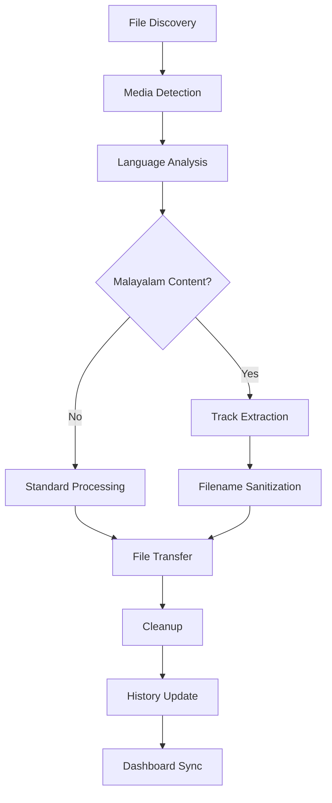
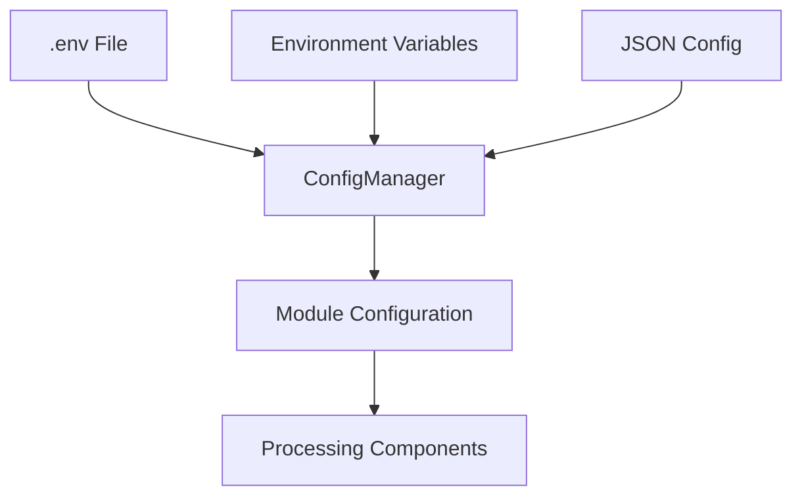
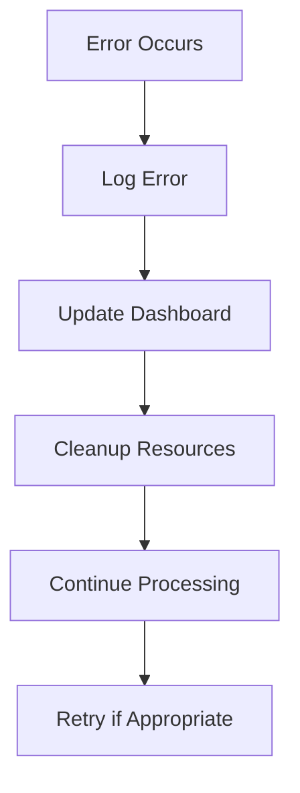

# Python Refactoring & Modular Architecture

## Overview

This document outlines the complete modular architecture of the Python-based Media Processor, detailing the planned and implemented refactoring that transformed the codebase from shell scripts to a modern, maintainable Python system.

## Architectural Principles 🏗️

### Design Philosophy
- **Single Responsibility**: Each module handles one specific aspect of media processing
- **Loose Coupling**: Modules interact through well-defined interfaces
- **High Cohesion**: Related functionality is grouped together
- **Dependency Injection**: Components receive their dependencies rather than creating them
- **Configuration Driven**: Behavior controlled through external configuration

### Code Organization
```
python_core/
├── media_processor.py           # Main orchestrator class
├── api_server.py               # Flask API server for web interface
├── requirements.txt            # Python dependencies
├── install_dependencies.sh     # Dependency installation script
└── modules/                    # Modular components
    ├── config/
    │   └── settings.py         # Configuration management
    ├── utils/
    │   ├── logging_setup.py    # Centralized logging
    │   └── file_history.py     # File processing history
    ├── api/
    │   └── dashboard_client.py # Dashboard API communication
    └── media/
        └── detector.py         # Media detection and analysis
```

## Module Specifications 📋

### 1. Core Orchestrator (`media_processor.py`)

**Purpose**: Main processing engine that coordinates all media processing operations.

**Key Responsibilities**:
- File monitoring and discovery
- Processing workflow orchestration  
- Error handling and recovery
- Cleanup and maintenance operations

**Key Methods**:
```python
class MediaProcessor:
    def __init__(config_path: str)
    def process_file(filepath: str, dry_run: bool = False) -> bool
    def start_monitoring() -> None
    def detect_media_attributes(filepath: str) -> Tuple[str, str, str, List[str]]
    def _extract_preferred_tracks(filepath: str, lang: str) -> Optional[str]
    def _transfer_file(source: str, target: str) -> bool
    def _sanitize_malayalam_filename(filename: str) -> str
```

**Enhanced Features**:
- **Malayalam-Only Extraction**: Exclusive Malayalam audio + English subtitle extraction
- **File Size Optimization**: Intelligent track removal with size reporting
- **Enhanced SMB**: NTLMV2 authentication with protocol negotiation
- **Filename Sanitization**: Clean Malayalam filename processing

### 2. Configuration Management (`modules/config/settings.py`)

**Purpose**: Unified configuration system supporting .env files and environment variables.

**Key Features**:
- **Multi-source Configuration**: .env files, environment variables, JSON fallback
- **Type Conversion**: Automatic conversion of string values to appropriate types
- **Validation**: Configuration validation with helpful error messages
- **Environment Mapping**: Clean mapping between .env variables and Python config keys

**Class Structure**:
```python
class ConfigManager:
    def __init__(config_path: str = None)
    def get(key: str, default: Any = None) -> Any
    def get_config() -> Dict[str, Any]
    def load_config() -> Dict[str, Any]
    def save_config(config: Dict[str, Any]) -> bool
    def _load_from_env() -> None
    def _load_env_file() -> None
```

**Configuration Mapping**:
```python
env_mapping = {
    "download_dir": "SOURCE_DIR",
    "smb_server": "SMB_SERVER", 
    "smb_username": "SMB_USERNAME",
    "malayalam_movie_path": "MALAYALAM_MOVIE_PATH",
    "bollywood_movie_path": "BOLLYWOOD_MOVIE_PATH",
    # ... comprehensive mapping for all configuration options
}
```

### 3. Media Detection (`modules/media/detector.py`)

**Purpose**: Advanced media type and language detection with priority-based routing.

**Detection Capabilities**:
- **Media Type**: Movie vs TV show classification using multiple patterns
- **Language Detection**: Priority-based language identification
- **Track Analysis**: Audio and subtitle track analysis using MediaInfo
- **Resolution Detection**: Automatic resolution tag detection

**Priority System**:
```python
class MediaDetector:
    # Priority 1: Malayalam (extract Malayalam audio + English subs only)
    malayalam_indicators = ['malayalam', 'mal', 'ml', 'kerala', 'mollywood']
    
    # Priority 2: Hindi/Bollywood (route to Bollywood folders)
    hindi_indicators = ['hindi', 'hin', 'hi', 'bollywood', 'multi', 'multilang']
    
    # Priority 3: English (route to English folders)
    english_indicators = ['english', 'eng', 'en', 'hollywood', 'usa', 'uk']
    
    # Priority 4: Regional (route to Malayalam folders as fallback)
    regional_indicators = ['telugu', 'tel', 'tamil', 'tam', 'kannada', 'kan']
```

**Enhanced Methods**:
```python
def detect_language_from_filename(filename: str) -> str
def detect_language_from_audio_tracks(file_path: str) -> Tuple[str, bool]
def detect_media_type(filename: str) -> str
def get_file_size(file_path: str) -> int
```

### 4. File History Management (`modules/utils/file_history.py`)

**Purpose**: Persistent tracking of processed files with comprehensive statistics.

**Features**:
- **JSON Storage**: Efficient JSON-based storage with atomic writes
- **Statistics Tracking**: Comprehensive processing metrics
- **Duplicate Prevention**: Automatic detection of already processed files
- **Cross-Component Sharing**: Unified history between Python and Node.js systems

**Class Structure**:
```python
class FileHistoryManager:
    def __init__(history_file: str)
    def add_file(file_path: str, **metadata) -> None
    def is_processed(file_path: str) -> bool
    def get_stats() -> Dict[str, Any]
    def get_recent_files(limit: int = 10) -> List[Dict]
    def _save_history() -> None
    def _load_history() -> None
```

**Statistics Tracked**:
- Total files processed
- Processing success/failure rates
- File type distribution
- Language distribution
- Size reduction from extraction
- Processing time metrics

### 5. Dashboard API Client (`modules/api/dashboard_client.py`)

**Purpose**: Clean interface for communicating with the web dashboard.

**Communication Features**:
- **Real-time Updates**: Live status updates to web interface
- **Error Reporting**: Detailed error reporting with context
- **Statistics Sync**: Automatic statistics synchronization
- **Connection Management**: Robust connection handling with retries

**API Methods**:
```python
class DashboardApiClient:
    def __init__(base_url: str, enabled: bool = True)
    def update_dashboard_api(event: str, **data) -> bool
    def test_smb_connection() -> Dict[str, Any]
    def sync_statistics() -> bool
    def _make_request(endpoint: str, data: Dict) -> bool
```

**Event Types**:
- `transferStart` - File transfer initiated
- `transferSuccess` - File transfer completed
- `transferFailed` - File transfer failed
- `extractionSuccess` - Track extraction completed
- `extractionFailed` - Track extraction failed
- `dryRun` - Dry run operation performed

### 6. Logging System (`modules/utils/logging_setup.py`)

**Purpose**: Centralized logging configuration with multiple output targets.

**Logging Features**:
- **Multiple Handlers**: Console and file logging with rotation
- **Log Levels**: Configurable log levels per component
- **Structured Logging**: Consistent log formatting across all modules
- **Debug Support**: Enhanced debugging with detailed context

**Configuration**:
```python
def setup_logging(log_file: str = None, log_level: str = "INFO") -> None
def get_logger(name: str) -> logging.Logger

# Log format: timestamp - module - level - message
# Example: 2023-12-16 18:30:45 - MediaProcessor - INFO - Processing file: movie.mkv
```

## Data Flow Architecture 🔄

### Processing Pipeline


### Configuration Flow


### Error Handling Flow


## Performance Optimizations ⚡

### Processing Optimizations
- **Lazy Loading**: Modules loaded only when needed
- **Caching**: MediaInfo results cached for duplicate files
- **Streaming**: Large file operations use streaming where possible
- **Parallel Operations**: Multiple file operations can run concurrently

### Memory Management
- **Context Managers**: Proper resource cleanup using context managers
- **Generator Functions**: Memory-efficient iteration over large datasets
- **Garbage Collection**: Explicit cleanup of large objects after processing

### I/O Optimizations
- **Atomic Operations**: File operations are atomic to prevent corruption
- **Buffer Management**: Optimized buffer sizes for different operation types
- **Path Optimization**: Efficient path handling and validation

## Testing Strategy 🧪

### Unit Testing
```python
# Each module has comprehensive unit tests
tests/
├── test_media_detector.py      # Media detection logic
├── test_config_manager.py      # Configuration management
├── test_file_history.py        # File history operations
├── test_dashboard_client.py    # API client functionality
└── test_media_processor.py     # Main processor logic
```

### Integration Testing
- **End-to-End Tests**: Complete processing workflow testing
- **SMB Integration**: Network transfer testing with mock SMB servers
- **Database Integration**: File history persistence testing
- **API Integration**: Dashboard communication testing

### Performance Testing
- **Load Testing**: Processing large numbers of files
- **Memory Testing**: Long-running operation memory usage
- **Network Testing**: SMB transfer performance under various conditions

## Security Considerations 🔒

### Credential Management
- **Environment Variables**: Sensitive data in environment variables only
- **File Permissions**: Restricted permissions on configuration files
- **Credential Rotation**: Support for credential rotation without restart

### Input Validation
- **Path Validation**: All file paths validated to prevent directory traversal
- **Filename Sanitization**: Malicious filename patterns filtered
- **Command Injection**: All external commands properly escaped

### Network Security
- **SMB Security**: Modern SMB protocols with authentication
- **API Security**: Dashboard API uses proper authentication
- **TLS Support**: HTTPS support for dashboard communications

## Extensibility Framework 🔧

### Plugin Architecture
```python
# Future plugin system design
class MediaProcessor:
    def register_detector(self, detector: MediaDetector) -> None
    def register_extractor(self, extractor: TrackExtractor) -> None
    def register_transfer(self, handler: TransferHandler) -> None
```

### Configuration Extensions
- **Custom Extractors**: User-defined extraction logic
- **Custom Patterns**: User-defined detection patterns
- **Custom Destinations**: User-defined transfer destinations

### API Extensions
- **Webhook Support**: Custom webhook notifications
- **External APIs**: Integration with external media databases
- **Cloud Services**: Cloud storage integration

---

*This modular architecture provides a robust foundation for the Media Processor, enabling easy maintenance, testing, and future enhancements while maintaining high performance and reliability.*